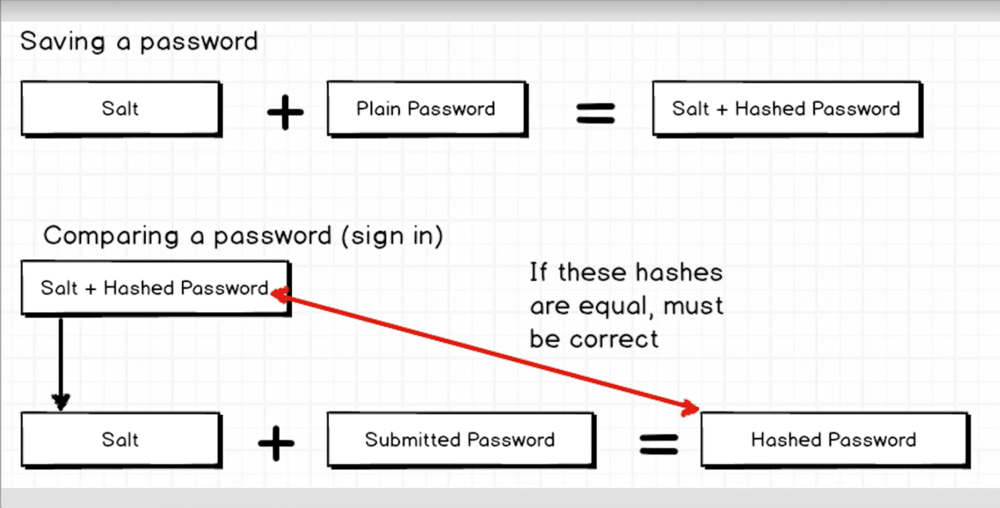
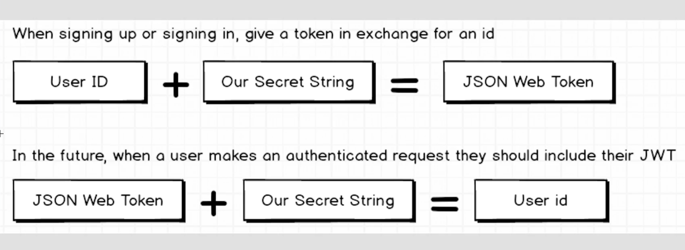
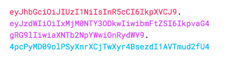
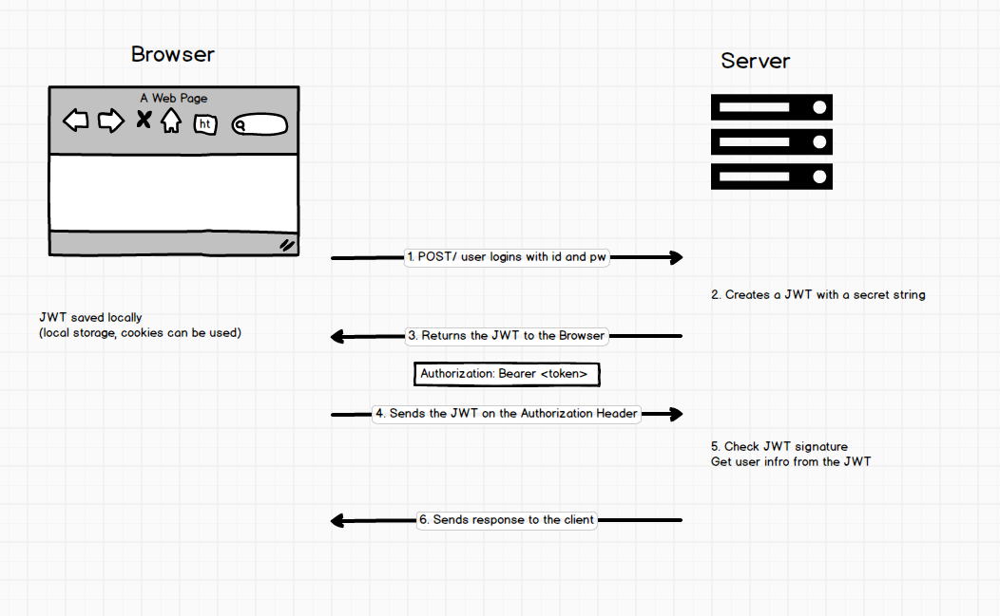
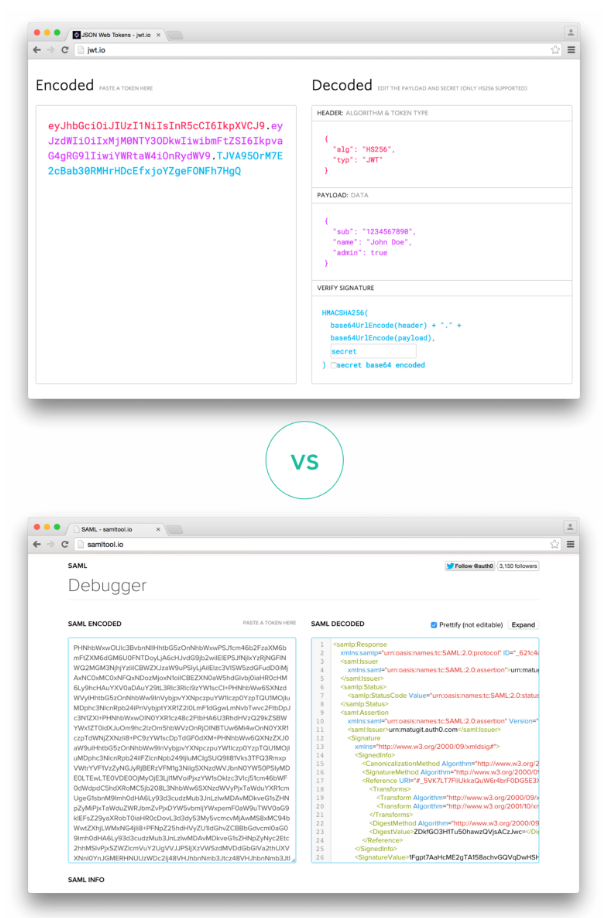

# server-side-auth

## tool 
Robomongo

## bcrypt process

## Tech Stack

        {
            "type": "node",
            "request": "attach",
            "name": "Attach",
            "restart": true,
            "port": 5858
        },

## JWT(Json Web Token)
- JWT is used when making an authenticated request after the user logged on
- Secret String is using for encrypting the User ID

### When you should use ?
- Authentication
- Information Exchang
securely transmitting information between parties

### JSON Web Token Structure
- Header
- Payload
- Signature

#### JWT Typical looks
xxxxx.yyyyy.zzzzz

#### Header
Base64Url encoded
~~~
{
    "alg": "RSA",  // or HMAC SHA256 that algorithm being used
    "typ": "JWT"

}
~~~

#### Payload
payload contains claim
claim is about an entity(the user) and additional metadata

##### Type of claims
- Reserved
- Public
- Private

#### Typical looks
Base64Url encoded
~~~
{
    "sub": "12345678",
    "name": "John Doe",
    "admin": true
}
~~~

#### Signature
Creation of Signature
~~~
HMACSHA256( // algorithm
  base64UrlEncode(header) + "." + // header encoded
  base64UrlEncode(payload),       // payload encoded
  secret)
~~~

##### Role of Signature
verification that the msg was not changed from the user

### How JWT works

### Why use JWT
- because JSON is less verbose than SAML, so it's a good choice using in HTTP environments

